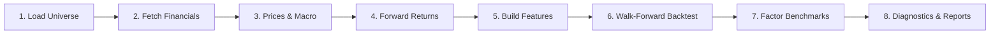

# Pipeline

The full pipeline is orchestrated by `main.py` and runs end-to-end with `make all`. Each stage saves intermediate artifacts so notebooks can load results without re-downloading.

## Stage Overview



## 1. Load Universe

Load the full S&P 500 membership table from `data/raw/sp500_monthly.csv`, including both current and historical constituents. The table contains `date_added` and `date_removed` columns that track when each symbol entered and left the index. All historical members are included so that the data download covers the complete survivorship-bias-free universe.

**Output**: Full membership DataFrame (~1000 entries covering ~940 unique symbols), plus list of all unique ticker symbols for data download.

## 2. Fetch Financial Statements

Download from yfinance:

- Quarterly income statements
- Quarterly balance sheets
- Quarterly cash flow statements
- Annual income statements (for YoY growth)

Failed downloads are logged but don't stop the pipeline.

**Output**: Raw statement DataFrames, reshaped into tidy `(symbol, date, item)` format.

## 3. Prices & Macro

Download daily close prices for all symbols with available financials, plus macro indicators:

| Ticker | Feature |
|---|---|
| `^VIX` | CBOE Volatility Index |
| `^TNX` | 10-Year Treasury Yield |
| `^IRX` | 3-Month Treasury Yield |
| `^GSPC` | S&P 500 Index Level |

Derived macro features include the yield curve spread, VIX regime, and S&P 500 momentum/volatility.

**Output**: `data/interim/close_prices.parquet`, `data/interim/macro_df.parquet`

## 4. Forward Returns & Volatility

For each `(symbol, date)` pair with financial data:

- **Forward return**: Next-quarter return computed from close prices (with 45-day earnings lag)
- **Realized volatility**: Standard deviation of daily returns in the forward quarter, annualized

**Output**: Returns and volatility DataFrames joined for modeling.

## 5. Build Features

Engineer ~180 features across multiple categories (see [Strategy Overview](strategy.md#features-180-total)). The feature matrix is indexed by `(symbol, date)` and includes all features plus forward return and volatility targets.

After building features, a **point-in-time membership filter** removes any `(symbol, date)` rows where the symbol was not in the S&P 500 at that date. This eliminates survivorship bias by ensuring the backtest universe at each quarter matches the actual index composition at that time.

**Output**: `data/processed/risk_model_df.parquet`, `data/processed/feature_cols.pkl`

## 6. Walk-Forward Backtest

The [walk-forward engine](api/modeling/train.md) trains the ensemble at each quarter, optimizes portfolios, and records:

- Gross and net returns
- Turnover and transaction costs
- Model quality (rank correlations)
- Feature importance from XGBoost
- Portfolio weights

**Output**: `models/prod_df.parquet`, `models/prod_fi.pkl`, `models/weights_history.pkl`

## 7. Factor Benchmarks & Evaluation

Compare the production strategy against single-factor benchmarks (Low Vol, Momentum, Quality, Value). Run bootstrap confidence intervals on excess returns.

**Output**: `models/factor_results.pkl`

## 8. Diagnostics & Reports

Generate diagnostic plots and run additional analysis:

- **Walk-forward diagnostics**: 6-panel figure (cumulative wealth, per-quarter excess, model quality, concentration, turnover, bootstrap distribution)
- **Simulation**: Daily portfolio simulation with drawdown analysis
- **External validity**: Regime dependence, prediction quality, concentration, feature importance stability

**Output**: `reports/figures/walk_forward_diagnostics.png`, `reports/figures/simulation.png`

## Data Flow

```
data/raw/sp500_monthly.csv     (immutable input — full membership history)
        │
        ▼
data/interim/                  (parquet: raw financials, prices, macro, membership)
        │
        ▼
data/processed/                (feature matrix filtered by point-in-time membership)
        │
        ▼
models/                        (backtest results, weights, factor benchmarks)
        │
        ▼
reports/figures/               (diagnostic plots)
```
